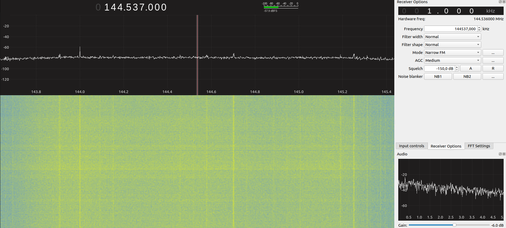
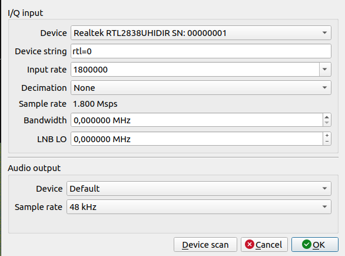

# GQRX and RTL-SDR SSH Appliance with Docker. 

### This repository is dedicated to docker container appliance for GQRX and RTL-SDR applications using Docker container.  



### Prerequisites. Before you begin, ensure you have the following packages installed on your system, for these repository, the Docker host machine **need to be linux for X11 works!**

- Git version 2.34.1
- Docker version 24.0.6, build ed223bc
- Docker Compose version v2.21.0

Also we'll need an SDR device, as [RTL-SDR RTL2832U DVB-T Tuner Dongles](https://www.rtl-sdr.com/buy-rtl-sdr-dvb-t-dongles/), this device will be used to sniffer the wireless channels and frequencies near to the Dongle. 

Just for reference, in this tutorial, i'm using the `R820T SDR & DVB-T NESDR Mini Device`. 

To check if the dongle you are using is working properly, you can use `dmesg` command and check devices in `/dev/` directory, as displayed below: 

```
root@root:~$ ls -l /dev/ | grep sw
crw-rw----+  1 root      plugdev  81,     2 mar 25 14:45 swradio0

root@root:~$ sudo dmesg | grep sw
[    0.094679] Spectre V1 : Mitigation: usercopy/swapgs barriers and __user pointer sanitization
[    0.094683] Spectre V2 : Spectre v2 / SpectreRSB mitigation: Filling RSB on context switch
[    0.764068] zswap: loaded using pool lzo/zbud
[    0.797329] Lockdown: swapper/0: hibernation is restricted; see man kernel_lockdown.7
[    1.188176] Console: switching to colour frame buffer device 240x67
[    3.994829] systemd[1]: Started Forward Password Requests to Wall Directory Watch.
[    4.045842] systemd[1]: Activating swap /swapfile...
[    4.064342] Adding 2097148k swap on /swapfile.  Priority:-2 extents:5 across:8265592k SSFS
[    4.064399] systemd[1]: Activated swap /swapfile.
[    5.598621] rtl2832_sdr rtl2832_sdr.4.auto: Registered as swradio0
[    6.011094] Console: switching to colour dummy device 80x25
[    6.375485] Console: switching to colour frame buffer device 240x67
[  735.781419] rtl2832_sdr rtl2832_sdr.4.auto: Registered as swradio0
[11013.392346] rtl2832_sdr rtl2832_sdr.4.auto: Registered as swradio0
[11018.796021] rtl2832_sdr rtl2832_sdr.4.auto: Registered as swradio0
[11518.215516] rtl2832_sdr rtl2832_sdr.4.auto: Registered as swradio0
[11637.969740] rtl2832_sdr rtl2832_sdr.4.auto: Registered as swradio0
[11697.001095] rtl2832_sdr rtl2832_sdr.4.auto: Registered as swradio0
[11861.332773] rtl2832_sdr rtl2832_sdr.4.auto: Registered as swradio0
[12430.176026] rtl2832_sdr rtl2832_sdr.4.auto: Registered as swradio0
[12470.894539] rtl2832_sdr rtl2832_sdr.4.auto: Registered as swradio0

```

---
### Getting Started: 

First, copy the line below and paste on your prompt to clone the repository:

```
git clone https://github.com/arthurcadore/spectrum-analyser
```

If you don't have installed the package Git yet, do it before try to clone the respository!

Navigate to the project directory:

```
cd ./spectrum-analyser
```

If you don't have Docker (and Docker-compose) installed on your system yet, it can be installed by run the following commands (Script for Ubuntu 22.04): 

```
./installDocker.sh
```
**If you had to install docker, please remember to reboot you machine to grant user privileges for docker application.** 

---
### Start Application's Container: 
Run the command below to start docker-compose file: 

```
docker compose up & 
```
The "&" character creates a process id for the command inputed in, with means that the container will not stop when you close the terminal. 

---

### Access Application:

Once the container is up and running, you can access the container by ssh://127.0.0.1:1025 (1025/TCP port is the default SSH port as defined in the docker-compose.yml file)

To login into container with SSH and access applications GUIs remotelly (use X11 interface socket), use flags `-XC`, as displayed below: 

```
ssh capacita@127.0.0.1 -p 1025 -XC
```

When you connect into the container by SSH Client, you can access the application programs installed in it by the commands below:  


#### To use GQRX program:
```
root@root:~$ gqrx 
Warning: Ignoring XDG_SESSION_TYPE=wayland on Gnome. Use QT_QPA_PLATFORM=wayland to run on Wayland anyway.
gr-osmosdr 0.2.0.0 (0.2.0) gnuradio 3.10.1.1
built-in source types: file fcd rtl rtl_tcp uhd hackrf bladerf rfspace airspy airspyhf soapy redpitaya freesrp 
file_source :warning: file size is not a multiple of item size
Resampling audio 96000 -> 48000
BandPlanFile is /home/root/.config/gqrx/bandplan.csv
BookmarksFile is /home/root/.config/gqrx/bookmarks.csv
[INFO] [UHD] linux; GNU C++ version 11.2.0; Boost_107400; UHD_4.1.0.5-3
libusb: warning [libusb_exit] device 4.1 still referenced
libusb: warning [libusb_exit] device 3.8 still referenced
libusb: warning [libusb_exit] device 3.5 still referenced
libusb: warning [libusb_exit] device 3.4 still referenced
libusb: warning [libusb_exit] device 3.3 still referenced
libusb: warning [libusb_exit] device 3.7 still referenced
libusb: warning [libusb_exit] device 3.2 still referenced
libusb: warning [libusb_exit] device 3.1 still referenced
libusb: warning [libusb_exit] device 2.1 still referenced
libusb: warning [libusb_exit] device 1.1 still referenced
Detached kernel driver
Found Rafael Micro R820T tuner
Reattached kernel driver
gr-osmosdr 0.2.0.0 (0.2.0) gnuradio 3.10.1.1
built-in source types: file fcd rtl rtl_tcp uhd hackrf bladerf rfspace airspy airspyhf soapy redpitaya freesrp 
Using device #0 Realtek RTL2838UHIDIR SN: 00000001
Detached kernel driver
Found Rafael Micro R820T tuner
[R82XX] PLL not locked!
[R82XX] PLL not locked!
[R82XX] PLL not locked!
Allocating 15 zero-copy buffers
Allocating 15 zero-copy buffers
Allocating 15 zero-copy buffers
```

In the GQRX execution, you'll need to select the correct device, for my variables, the configuration is displayed below:  


Once the GQRX is working, the GUI will shown the as displayed below:


#### To use RTL-SDR commands: 
```
root@root:~$ rtl_adsb -VS
Found 1 device(s):
  0:  Realtek, RTL2838UHIDIR, SN: 00000001

Using device 0: Generic RTL2832U OEM
Detached kernel driver
Found Rafael Micro R820T tuner
Tuner gain set to automatic.
Tuned to 1090000000 Hz.
Exact sample rate is: 2000000.052982 Hz
Sampling at 2000000 S/s.
Allocating 12 zero-copy buffers
*7c8c468dd3502d;
DF=15 CA=4
ICAO Address=8c468d
*51e707264d538a;
DF=10 CA=1
ICAO Address=e70726
*7d15f5d6d450fb;
DF=15 CA=5
ICAO Address=15f5d6
*3566c708824b4f;
DF=6 CA=5
ICAO Address=66c708
*74b7165c6943c6;
DF=14 CA=4
```

--- 
### Stop Container: 
To stop the running container, use the following command:

```
docker-compose down
```

This command stops and removes the containers, networks, defined in the docker-compose.yml file.
--- 
